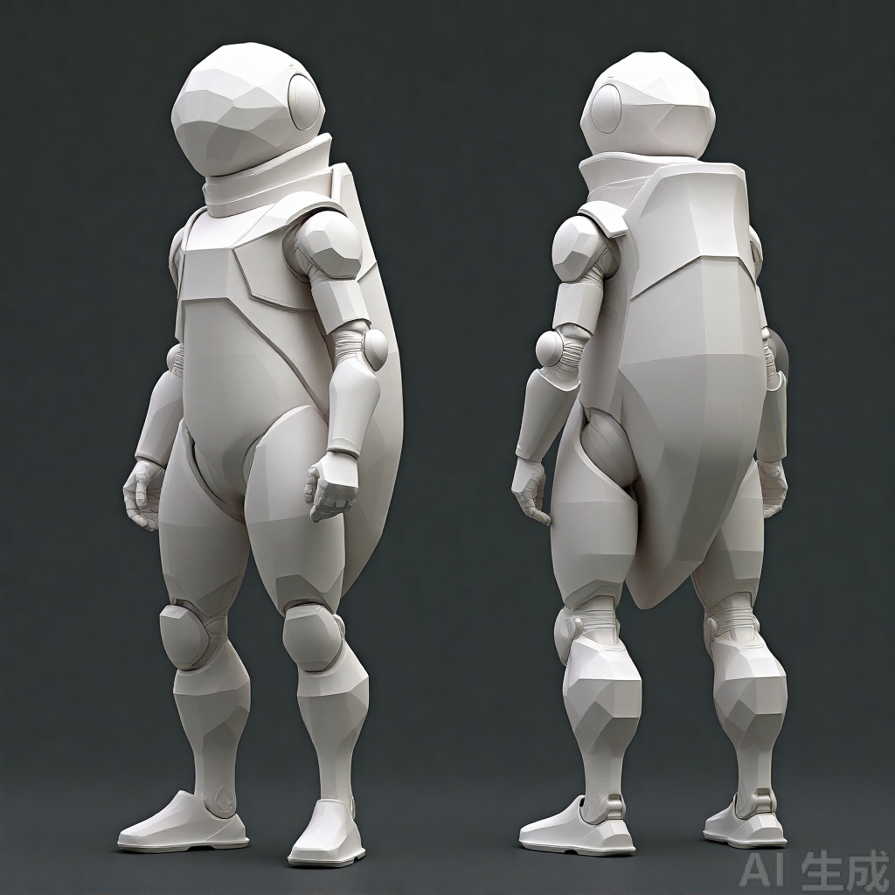
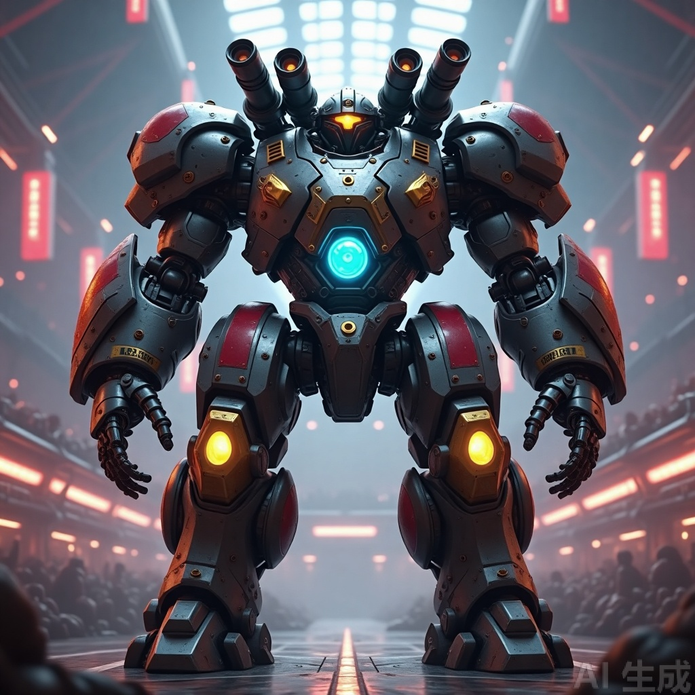

# 视觉表现系统设计规范

**版本**：v1.0
**日期**：2026-08-21
**适用范围**：《石头剪刀升龙拳》MVP 后续视觉升级
**交付性质**：设计规范文档（不修改代码）
**配套参考图**：`docs/assets/boss-mech.png`、`docs/assets/player-whitebox.png`

---

## 1. 总纲

### 1.1 设计目标

为《石头剪刀升龙拳》MVP 的 5 条核心视觉体验需求提供可直接落地的系统设计规范：

1. 玩家选招回合与 BOSS 攻击回合必须**清晰可辨**；
2. 玩家已选技能需**醒目显示在血条上方**；
3. 玩家招式具备**关键帧动画**（剪刀 / 升龙 / 石头）；
4. 玩家形象升级为**Unity 默认风格人体白盒**（低面数、类人骨架）；
5. 现有红色方块 BOSS 升级为**机甲巨人**形象。

### 1.2 核心视觉语言

**霓虹竞技场 × 机甲格斗 × 阶段色彩叙事**

- **选招回合** = 冷静理智（深空蓝 #101A2E），光照稳定、界面安静；
- **BOSS 攻击回合** = 危机压迫（警报红 #1A0D0D），光照转红、渐晕脉冲；
- **玩家白盒** = 哑光白（#F2F2F5）+ 玩家主色发光描边，肢体分段清晰；
- **机甲 BOSS** = 深灰装甲（#2A2D35）+ 暗红警示涂装（#8A1F2B）+ 金色关节（#FFC107）+ 青色核心（攻击时转红充能）。

### 1.3 性能约束

| 指标 | 限制 | 说明 |
|------|------|------|
| 玩家白盒三角面 | ≤ 3,000 / 人 | 4 人同屏 ≤ 12,000 面 |
| BOSS 三角面 | ≤ 8,000 | 含能量核心、关节发光 |
| Draw Call | ≤ 50（不透明 + 透明） | 尽量合并 Mesh / 共享材质 |
| 阶段过渡时长 | 0.4s ~ 0.8s | 推荐 0.6s，禁止硬切 |
| 招式动画时长 | ≤ 1.0s | 与 EXECUTE 段（2.4s）对齐 |

### 1.4 系统关系架构

```
[回合状态机 PHASE]
        │
        ├─→ 阶段氛围区分系统（光照/雾/渐晕/UI 主题）
        ├─→ 技能展示系统（血条上方技能卡）
        ├─→ 招式动画系统（玩家出招动画 FSM）
        │       └─→ 玩家人形白盒系统（骨骼层级 + 姿态接口）
        └─→ 机甲 BOSS 系统（待机/前摇/受击/死亡）
```

### 1.5 统一文档模板

每个系统章节按以下模板展开：

1. **系统定位与目标**（1 段）
2. **系统构成**（模块拆解表）
3. **数据结构**（代码块，JS 对象/伪代码）
4. **接口定义**（函数签名表）
5. **与现有代码对接点**（`index.html` 行号/函数名）
6. **制作流程规范**（步骤 + 优先级标记）
7. **验收标准**（Checklist，可勾选）

---

## 2. 系统一：阶段氛围区分系统（PhaseVisualSystem）

### 2.1 系统定位与目标

将「玩家选招回合」与「BOSS 攻击回合」从"仅靠小标签和倒计时环颜色"升级为**全空间氛围切换**。通过场景光照、雾色、全屏渐晕、顶部/底部光带、UI 主题、倒计时环样式六层联动，让玩家一眼就能判断当前阶段。

### 2.2 系统构成

| 模块 | 职责 | 优先级 |
|------|------|--------|
| `PhaseTheme` | 每个 `PHASE` 的主题参数表 | P0 |
| `ThemeTransition` | 颜色/强度插值器 | P0 |
| `AtmosphereLayer` | 控制 `scene.background` / `scene.fog` / 灯光颜色 | P0 |
| `VignetteLayer` | CSS radial-gradient 全屏渐晕层 | P1 |
| `EdgeLightLayer` | 顶部/底部氛围光带（HTML div + 渐变） | P1 |
| `PhaseRing` | 倒计时环主题化绘制（替换现有 ring） | P0 |
| `BannerPulse` | 顶部阶段横幅呼吸脉冲动画 | P1 |

### 2.3 数据结构

```javascript
// 主题参数表（每个 PHASE 一份）
const PHASE_THEMES = {
  SELECT: {
    bg: new THREE.Color(0x0d0d18),        // 场景背景
    fog: new THREE.Color(0x101a2e),       // 雾色
    ambient: { color: 0x404b60, intensity: 0.6 },
    dir: { color: 0xaaccff, intensity: 1.0 },
    rim: { color: 0x4ec9ff, intensity: 0.8 },
    vignette: { inner: 'rgba(13,13,24,0)', outer: 'rgba(16,26,46,0.55)' },
    edge: { top: 'rgba(78,201,255,0.13)', bottom: 'rgba(78,201,255,0.07)' },
    accent: '#4EC9FF',                    // 倒计时环/提示色
    banner: { bg: 'rgba(16,26,46,0.85)', border: '#4EC9FF', pulse: false },
  },
  BOSS_ATTACK: {
    bg: new THREE.Color(0x1a0d0d),
    fog: new THREE.Color(0x2a0d0d),
    ambient: { color: 0x603030, intensity: 0.7 },
    dir: { color: 0xff8888, intensity: 1.1 },
    rim: { color: 0xff2d2d, intensity: 1.2 },
    vignette: { inner: 'rgba(60,10,10,0.3)', outer: 'rgba(138,31,43,0.7)' },
    edge: { top: 'rgba(255,45,45,0.27)', bottom: 'rgba(138,31,43,0.13)' },
    accent: '#FF2D2D',
    banner: { bg: 'rgba(60,10,10,0.9)', border: '#FF2D2D', pulse: true },
  },
  // EXECUTE / RESOLVE / ROUND_END / VICTORY / GAMEOVER 同理…
};

// 过渡状态
const THEME_TRANSITION = {
  from: PHASE_THEMES.SELECT,
  to: PHASE_THEMES.BOSS_ATTACK,
  t: 0,           // 0..1
  duration: 0.6,  // 秒
};
```

### 2.4 接口定义

| 函数 | 签名 | 说明 |
|------|------|------|
| `applyPhaseTheme` | `(phase, immediate=false)` | 触发主题切换；`immediate=true` 时瞬切 |
| `updateThemeTransition` | `(dt)` | 每帧调用，lerp 颜色与强度 |
| `lerpColor` | `(a, b, t)` | THREE.Color 线性插值辅助 |
| `drawPhaseRing` | `(theme, progress)` | 主题化倒计时环绘制 |

### 2.5 与现有代码对接点

| 现有代码 | 当前行为 | 改造方式 |
|----------|----------|----------|
| `setPhase()`（L822） | 仅改顶部标签 class + 消息文字 | 末尾调用 `applyPhaseTheme(phase)` |
| `scene.background / scene.fog`（L204-205） | 硬编码 #101a2e | 接入 AtmosphereLayer，随主题变化 |
| `ambientLight / dirLight / rimLight`（L212-225） | 固定颜色 | 接入 ThemeTransition 插值 |
| `drawSelectRing()`（L1172） | 蓝色环 | 统一为 `drawPhaseRing(theme, ratio)` |
| `drawBossWarnRing()`（L1183） | 红色警告环 | 统一为 `drawPhaseRing(theme, ratio)` |
| CSS `.phase-select` / `.phase-boss` | 类名切换 | 扩展为 `data-theme` 属性，控制 CSS 变量 |

### 2.6 制作流程规范

**P0 流程**

1. **定义主题表**：在 `index.html` 的 `const` 区新增 `PHASE_THEMES`，覆盖 `SELECT / EXECUTE / BOSS_ATTACK / RESOLVE / ROUND_END / VICTORY / GAMEOVER`。
2. **实现 `applyPhaseTheme(phase, immediate)`**：根据 phase 设置 `THEME_TRANSITION.from/to/t`。
3. **实现 `updateThemeTransition(dt)`**：在 `renderLoop` 每帧调用，lerp 所有颜色/强度；t≥1 后停止。
4. **改造 `setPhase()`**：切换 phase 时调用 `applyPhaseTheme(phase)`。
5. **CSS 变量扩展**：在 `:root` 与 `.game-stage` 上定义 `--theme-accent` / `--theme-edge-top` 等变量，通过 `data-theme` 属性切换。

**P1 流程**

6. **全屏渐晕层**：新增一个 `position:fixed; inset:0; pointer-events:none; z-index:5` 的 div，使用 `radial-gradient` 背景，透明度与颜色由 JS 每帧更新。
7. **顶部/底部光带**：新增两个 div 分别位于 `#top-hud` 上方和 `#bottom-hud` 下方，使用线性渐变背景，颜色取自 `theme.edge`。
8. **横幅脉冲**：为 `.phase-indicator` 增加 `box-shadow` 脉冲动画，仅在 `theme.banner.pulse=true` 时启用。

### 2.7 验收标准

- [ ] 切换阶段时，背景、雾色、环境光、主光、轮廓光在 0.6s 内平滑过渡，无硬切。
- [ ] 选招阶段以蓝/青色为主，BOSS 攻击阶段以红/橙为主，一眼可辨。
- [ ] 倒计时环颜色随阶段主题变化，且大小/样式统一。
- [ ] 顶部阶段横幅在 BOSS 攻击阶段有呼吸脉冲效果。
- [ ] 所有过渡每帧开销 < 0.5ms（目标 60 FPS）。

---

## 3. 系统二：技能展示系统（MoveDisplaySystem）

### 3.1 系统定位与目标

将玩家当前回合已选技能从底部 18px 小 combo 槽，迁移到**血条正上方的醒目技能卡区域**。让玩家无需低头即可确认自己的选择，并在锁定后给出明确反馈。

### 3.2 系统构成

| 模块 | 职责 | 优先级 |
|------|------|--------|
| `MoveCardRenderer` | 渲染血条上方的技能卡 | P0 |
| `MoveCardState` | 单张卡片状态机（empty / pending / filled / locked） | P0 |
| `MoveCardAnim` | 入场/锁定/清空动画 | P1 |
| `MoveIconTheme` | 技能图标与配色（复用 `MOVES` 表） | P0 |

### 3.3 数据结构

```javascript
// 每个玩家的技能卡状态（与 p.combo[] 绑定）
const moveCardState = {
  cards: [
    { state: 'empty', move: null, animT: 0 },
    { state: 'empty', move: null, animT: 0 },
  ],
  lockAnimT: 0,   // 全部锁定后金光动画
};

// 每张卡片 DOM 结构（示意）
/*
<div class="move-card" data-state="empty" data-move="">
  <div class="move-card__glow"></div>
  <div class="move-card__icon">✊</div>
  <div class="move-card__label">石头</div>
</div>
*/
```

### 3.4 接口定义

| 函数 | 签名 | 说明 |
|------|------|------|
| `initMoveCards` | `(pIdx)` | 为玩家 pIdx 初始化两张卡片 DOM |
| `setMoveCard` | `(pIdx, slot, move)` | 第 slot 槽填入技能 move，触发动画 |
| `lockMoveCards` | `(pIdx)` | 全部锁定，播放金光确认动画 |
| `clearMoveCards` | `(pIdx)` | 回合结束清空 |
| `updateMoveCardAnims` | `(dt)` | 每帧更新动画 |

### 3.5 与现有代码对接点

| 现有代码 | 当前行为 | 改造方式 |
|----------|----------|----------|
| `.p-hud` 结构（L41-58） | 血条下方 `.p-combo` 18px 小槽 | 改为血条上方 `.move-cards` 容器 |
| `MOVES` 表（L141-146） | 已有图标/颜色/类型 | 复用，扩展 `iconSvg` 可选 |
| `tryConfirmGesture()`（L856） | 玩家确认技能时更新 `p.combo` | 新增 `setMoveCard(pIdx, slot, move)` 调用 |
| `updateHud()`（L1127） | 刷新玩家 HUD | 在血条上方渲染/更新技能卡 |
| `setPhase('RESOLVE')` | 进入结算 | 为所有玩家调用 `lockMoveCards(pIdx)` |
| `setPhase('SELECT')` | 新选招回合 | 为所有玩家调用 `clearMoveCards(pIdx)` |

### 3.6 制作流程规范

**P0 流程**

1. **改造 HUD 模板**：将 `.p-hud` 内血条下方的小 `.p-combo` 整体移到血条上方，改为两张 56×56px（移动端）/ 64×64px（桌面端）的技能卡。
2. **定义卡片状态样式**：
   - `empty`：虚线边框、半透明、图标空；
   - `pending`：实色底、技能图标、玩家主色描边；
   - `filled`：与 pending 相同（表示已选未锁定）；
   - `locked`：金色描边、微光、显示"锁定"角标。
3. **实现 `setMoveCard(pIdx, slot, move)`**：将图标与名称写入对应卡片 DOM，并设置 `data-state="filled"`，播放弹入动画（scale 0.8→1.05→1 + opacity 0→1，0.25s）。
4. **实现 `lockMoveCards(pIdx)`**：将两张卡片设为 `locked`，播放金光脉冲（0.4s）。
5. **实现 `clearMoveCards(pIdx)`**：动画淡出后重置为 `empty`。

**P1 流程**

6. **图标优化**：为剪刀/石头/升龙设计或复用清晰图标（emoji 可保留为 MVP 占位）。
7. **提示文字**：卡片下方显示"已选：剪刀"等简短文字，锁定后替换为"已锁定"。
8. **组合连击高亮**：当两张卡形成克制/连击组合时，卡间出现动态连线。

### 3.7 验收标准

- [ ] 每个玩家血条上方稳定显示 2 个技能卡槽。
- [ ] 选招后 0.25s 内，对应槽以弹入动画显示正确图标。
- [ ] 进入 EXECUTE/RESOLVE 阶段后，所有已选卡片切换为锁定态，带金光反馈。
- [ ] 新选招回合开始时，卡片清空并回到 empty 态。
- [ ] 4 人同屏时无错位、无重叠、适配 16:9 / 4:3 / 竖屏。

---

## 4. 系统三：招式动画系统（MoveAnimationSystem）

### 4.1 系统定位与目标

将当前"摆臂瞬切"升级为**关键帧插值动画**。每个招式包含蓄力 → 出招 → 收招三段，基于人形白盒骨骼驱动，让玩家能明显读出"出拳 / 上勾 / 抱臂"三种动作差异。

### 4.2 系统构成

| 模块 | 职责 | 优先级 |
|------|------|--------|
| `MoveClip` | 招式关键帧数据（每招 3 段） | P0 |
| `AnimState` | 动画状态机（IDLE / WINDUP / STRIKE / RECOVER） | P0 |
| `PoseBlender` | 关键帧之间 slerp/lerp 插值 | P0 |
| `Easing` | 缓动函数表（easeInQuad / easeOutBack / easeInOutSine） | P1 |
| `VFXTrail` | 出拳/升龙速度线/残影（可选） | P2 |

### 4.3 动画状态机

```
IDLE（待机，双臂自然下垂）
   │ 收到 playMove(move)
   ▼
WINDUP（蓄力，0.2s）
   │ 蓄力到位
   ▼
STRIKE（出招，0.15s）
   │ 击中/释放
   ▼
RECOVER（收招，0.35s）
   │ 回到 IDLE
   ▼
IDLE
```

### 4.4 关键帧定义

关节以局部旋转（Euler/Quaternion）定义。以下关键帧为**右臂**示意，左臂对称或固定。

#### 4.4.1 剪刀 —— 手臂伸直出拳

| 阶段 | 右肩 | 右肘 | 右腕 | 左臂 |
|------|------|------|------|------|
| IDLE | 下垂 | 微曲 | 自然 | 下垂 |
| WINDUP | 肩后拉 30°，肘屈 90° | 屈 90° | 握拳后收 | 护胸 |
| STRIKE | 肩前屈 90°，肘伸展 0° | 伸直 | 拳面超前 | 护胸 |
| RECOVER | 缓慢回到 IDLE | — | — | 回 IDLE |

#### 4.4.2 升龙 —— 手臂上举

| 阶段 | 右肩 | 右肘 | 右腕 | 左臂 |
|------|------|------|------|------|
| IDLE | 下垂 | 微曲 | 自然 | 下垂 |
| WINDUP | 肩下沉 15°，肘屈 45° | 屈 45° | 握拳贴腰 | 下垂 |
| STRIKE | 肩外展上举 160°，肘屈 30° | 屈 30° | 拳朝斜上 | 自然 |
| RECOVER | 缓慢回到 IDLE | — | — | 回 IDLE |

#### 4.4.3 石头 —— 双手交叉抱臂

| 阶段 | 双肩 | 双肘 | 双腕 | 躯干 |
|------|------|------|------|------|
| IDLE | 下垂 | 微曲 | 自然 | 直立 |
| WINDUP | 双臂向两侧张开 45° | 微屈 | 张开 | 直立 |
| STRIKE | 双臂胸前交叉，前臂重叠 | 屈 90° | 握拳贴胸 | 微前倾 |
| RECOVER | 缓慢回到 IDLE | — | — | 回直立 |

### 4.5 数据结构

```javascript
// 关节枚举
const JOINTS = {
  ROOT: 'root',
  HIPS: 'hips', SPINE: 'spine', CHEST: 'chest',
  NECK: 'neck', HEAD: 'head',
  L_CLAVICLE: 'lClavicle', L_SHOULDER: 'lShoulder', L_ELBOW: 'lElbow', L_WRIST: 'lWrist', L_HAND: 'lHand',
  R_CLAVICLE: 'rClavicle', R_SHOULDER: 'rShoulder', R_ELBOW: 'rElbow', R_WRIST: 'rWrist', R_HAND: 'rHand',
  L_HIP: 'lHip', L_KNEE: 'lKnee', L_ANKLE: 'lAnkle', L_FOOT: 'lFoot',
  R_HIP: 'rHip', R_KNEE: 'rKnee', R_ANKLE: 'rAnkle', R_FOOT: 'rFoot',
};

// 姿态 = 每个关节的局部旋转（THREE.Quaternion）
const Pose = {
  [JOINTS.R_SHOULDER]: new THREE.Quaternion(),
  // …其他关节
};

// 招式片段
const MoveClip = {
  move: 'scissors', // 'scissors' | 'dragon' | 'rock' | 'idle'
  frames: [
    { name: 'WINDUP',  pose: Pose, duration: 0.20 },
    { name: 'STRIKE',  pose: Pose, duration: 0.15 },
    { name: 'RECOVER', pose: Pose, duration: 0.35 },
  ],
  easings: [easeInQuad, easeOutBack, easeInOutSine],
};

// 动画运行时状态
const animState = {
  move: 'idle',
  phase: 'IDLE',        // IDLE / WINDUP / STRIKE / RECOVER
  phaseT: 0,            // 当前阶段内时间 0..1
  frameIdx: 0,
  speed: 1.0,
};
```

### 4.6 接口定义

| 函数 | 签名 | 说明 |
|------|------|------|
| `playMove` | `(move, speed=1.0)` | 触发招式动画；若已有动画则覆盖 |
| `updateMoveAnim` | `(dt)` | 每帧推进动画状态机与插值 |
| `samplePose` | `(clip, phaseT)` | 返回当前采样姿态 |
| `applyPoseToRig` | `(pose, rig)` | 将姿态写入人形白盒骨骼 |
| `setIdlePose` | `(rig)` | 设置待机姿态 |

### 4.7 与现有代码对接点

| 现有代码 | 当前行为 | 改造方式 |
|----------|----------|----------|
| `updateAvatar()`（L1050-1113） | 根据 combo 瞬态摆臂 | 改为调用 `updateMoveAnim(dt)` + `applyPoseToRig` |
| `updateExecute()`（L885） | 进入 EXECUTE 段 | 在段开始时为每个玩家 `playMove(p.combo[0])` / `playMove(p.combo[1])` |
| `setLimb()`（L445-454） | 两点定骨骼 | 废弃，由骨骼层级 + 姿态接口替代 |
| `createAvatar()`（L422-443） | 创建胶囊+圆柱 | 由人形白盒系统替代，但保留颜色风格 |

### 4.8 制作流程规范

**P0 流程**

1. **定义关节枚举**：在全局 `const` 区定义 `JOINTS` 常量。
2. **设计 IDLE 姿态**：双臂自然下垂，肩部略外展 5°，肘微屈 10°。
3. **制作三个招式的关键帧**：只包含上半身（肩/肘/腕/胸/颈），下半身保持站立。
4. **实现 `playMove(move)`**：重置 `animState`，设置 move 与 phase。
5. **实现 `updateMoveAnim(dt)`**：推进 `phaseT`，阶段切换时进入下一段，全部结束后回到 IDLE。
6. **实现 `samplePose` 与 `applyPoseToRig`**：将姿态应用到人形白盒骨骼。
7. **改造 `updateAvatar()`**：不再直接摆臂，而是调用 `updateMoveAnim` + `applyPoseToRig`。

**P1 流程**

8. **添加缓动曲线**：WINDUP 用 easeInQuad，STRIKE 用 easeOutBack，RECOVER 用 easeInOutSine。
9. **出招瞬间肢体高亮**：STRIKE 阶段 0.1s 内将出招手臂材质 emissive 设为玩家主色。
10. **躯干微动**：出招时胸部随动作前倾/后仰 5°，增强力量感。

**P2 流程**

11. **速度线/残影**：在 STRIKE 阶段沿手臂方向生成 2~3 个半透明残影 Mesh，0.15s 内淡出。

### 4.9 验收标准

- [ ] 剪刀动作能明显读出"右臂前刺、肘伸直、拳朝前"。
- [ ] 升龙动作能明显读出"右臂上举、肩外展、拳朝上"。
- [ ] 石头动作能明显读出"双前臂在胸前交叉抱臂"。
- [ ] 三段动画总时长约 0.7s，可配置加速/减速。
- [ ] 动画可被打断/覆盖，无骨骼错位或抖动。
- [ ] 4 人同屏各自独立播放，互不干扰。

---

## 5. 系统四：玩家人形白盒系统（HumanoidRigSystem）

### 5.1 系统定位与目标

将现有"胶囊躯干 + 圆柱手臂"升级为**Unity 默认风格的标准人体白盒**：低面数、类人骨架、四肢分段清晰、可支撑后续行走/蹲跳动画。重点不是高模，而是**人体比例正确、关节可读**。

### 5.2 系统构成

| 模块 | 职责 | 优先级 |
|------|------|--------|
| `HumanoidRigBuilder` | 程序化生成骨骼层级与网格 | P0 |
| `Bone` | 单关节对象（THREE.Group + Mesh） | P0 |
| `MeshBuilder` | 用基本几何体拼出身体各部位 | P0 |
| `MaterialSet` | 白盒哑光材质 + 玩家主色发光描边 | P1 |
| `PoseInterface` | 姿态读取/写入接口 | P0 |
| `JointHelper` | 调试关节轴向（可选） | P2 |

### 5.3 骨骼层级树

```
root (场景坐标定位)
 └─ hips（骨盆，所有下肢与脊柱根）
    ├─ spine（脊柱下段）
    │   └─ chest（胸腔）
    │       ├─ neck（颈部）
    │       │   └─ head（头部）
    │       ├─ lClavicle（左锁骨）
    │       │   └─ lShoulder（左肩）
    │       │       └─ lElbow（左肘）
    │       │           └─ lWrist（左腕）
    │       │               └─ lHand（左手）
    │       └─ rClavicle（右锁骨）
    │           └─ rShoulder（右肩）
    │               └─ rElbow（右肘）
    │                   └─ rWrist（右腕）
    │                       └─ rHand（右手）
    ├─ lHip（左髋）
    │   └─ lKnee（左膝）
    │       └─ lAnkle（左踝）
    │           └─ lFoot（左脚）
    └─ rHip（右髋）
        └─ rKnee（右膝）
            └─ rAnkle（右踝）
                └─ rFoot（右脚）
```

### 5.4 程序化网格规格

全身比例以**头部半径 0.24m** 为基准，身高约 1.68m（头身比约 1:7）。

| 部位 | 几何体 | 尺寸 | 面数（段数） | 材质 |
|------|--------|------|--------------|------|
| 头部 Head | `SphereGeometry(0.24, 12, 10)` | 半径 0.24 | ~200 | 哑光白 |
| 颈部 Neck | `CylinderGeometry(0.08, 0.09, 0.12, 10)` | 长 0.12 | ~40 | 哑光白 |
| 胸腔 Chest | `CapsuleGeometry(0.22, 0.45, 4, 12)` | 半径 0.22，高 0.45 | ~400 | 哑光白 |
| 骨盆 Hips | `SphereGeometry(0.20, 10, 8)` 压扁 | y 缩放 0.6 | ~200 | 哑光白 |
| 上臂 UpperArm | `CapsuleGeometry(0.07, 0.28, 4, 10)` | 长 0.28 | ~150 | 哑光白 |
| 前臂 ForeArm | `CapsuleGeometry(0.065, 0.26, 4, 10)` | 长 0.26 | ~150 | 哑光白 |
| 手 Hand | `BoxGeometry(0.10, 0.12, 0.05)` | — | ~12 | 哑光白 |
| 大腿 Thigh | `CapsuleGeometry(0.10, 0.40, 4, 10)` | 长 0.40 | ~200 | 哑光白 |
| 小腿 Shin | `CapsuleGeometry(0.09, 0.40, 4, 10)` | 长 0.40 | ~200 | 哑光白 |
| 脚 Foot | `BoxGeometry(0.12, 0.08, 0.25)` | 前伸 0.10 | ~12 | 哑光白 |
| 关节球 Joint | `SphereGeometry(0.04, 8, 6)` | 手肘/膝/腕可视 | ~80 | 哑光白 |

**总面数预算**：单角色约 1,800 ~ 2,500 三角面；4 人同屏 ≤ 10,000 面。

### 5.5 材质规格

```javascript
const whiteBoxMat = new THREE.MeshStandardMaterial({
  color: 0xf2f2f5,
  roughness: 0.7,
  metalness: 0.05,
  emissive: 0x000000,
});

// 玩家主色描边（可选后期 via OutlinePass 或 Rim Light）
const playerRimMat = new THREE.MeshBasicMaterial({
  color: playerColor,
  side: THREE.BackSide,
  transparent: true,
  opacity: 0.4,
});
```

### 5.6 接口定义

| 函数 | 签名 | 说明 |
|------|------|------|
| `buildHumanoid` | `(style)` | 返回 HumanoidRig 对象 |
| `setJointLocalRotation` | `(rig, jointName, q)` | 设置关节局部旋转 |
| `setJointLocalEuler` | `(rig, jointName, x, y, z)` | 同上，Euler 便捷版 |
| `getJointWorldPosition` | `(rig, jointName)` | 获取关节世界坐标，用于碰撞/特效 |
| `applyPose` | `(rig, pose)` | 批量应用姿态 |
| `setEmissive` | `(rig, jointName, color, intensity)` | 出招高亮 |

### 5.7 与现有代码对接点

| 现有代码 | 当前行为 | 改造方式 |
|----------|----------|----------|
| `createAvatar()`（L422-443） | 胶囊躯干 + 圆柱手臂 | 替换为 `buildHumanoid(style)` |
| `setLimb()`（L445-454） | 两点摆臂 | 废弃 |
| `PLAYER_STYLES`（L411） | 玩家配色 | 保留，用于材质描边与 emissive |
| `updateAvatar()`（L1050-1113） | 直接移动手臂 mesh | 改为 `applyPose(rig, currentPose)` |
| `avatarGroup` 中的碰撞/位置 | 玩家站位与受击 | 继续使用 `root.position`，碰撞胶囊保留 |

### 5.8 制作流程规范

**P0 流程**

1. **建立骨骼层级**：用 `THREE.Group` 嵌套实现 5.3 层级树，每个关节保存 rest offset。
2. **生成基础网格**：为每个部位创建对应几何体并挂到对应关节下；Mesh 中心点位于关节处或按长度偏移。
3. **定义 T-Pose / A-Pose**：选择 A-Pose（双臂自然下垂外展 10°）作为 rest pose，更自然。
4. **实现 `buildHumanoid(style)`**：根据玩家编号返回不同描边颜色的 rig。
5. **实现 `applyPose(rig, pose)`**：将姿态中每个关节的旋转写入 rig。
6. **替换 `createAvatar()`**：返回新白盒 rig。
7. **改造 `updateAvatar()`**：驱动动画系统输出的姿态。

**P1 流程**

8. **添加玩家描边**：为每个肢体 mesh 克隆一个 BackSide mesh，略微放大，使用玩家主色半透明材质。
9. **待机呼吸**：IDLE 时胸腔做 1.5s 周期的轻微缩放/上下位移。
10. **关节球可见**：肘/膝/腕处添加小球，增强白盒可读性。

**P2 流程**

11. **行走/蹲跳预留**：下肢骨骼已就绪，后续可通过髋/膝/踝旋转实现。
12. **LOD**：远景时隐藏关节球、降低几何体段数。

### 5.9 概念参考图



> 说明：图中为高质量白模概念图。程序化实现时**简化为胶囊+圆柱+球关节**，保留人体比例与分段，不保留宇航服外甲与鞋子细节。

### 5.10 验收标准

- [ ] 角色一眼能识别为"人"，头/躯干/四肢/脚分段明确。
- [ ] 单角色三角面 ≤ 3,000；4 人同屏 ≤ 12,000。
- [ ] 骨骼层级与 5.3 一致，支持肩/肘/腕独立旋转。
- [ ] 4 名玩家通过描边颜色区分（蓝/绿/金/紫）。
- [ ] 站姿自然，无穿模、无比例失调。
- [ ] 出招高亮效果明显且不刺眼。

---

## 6. 系统五：机甲 BOSS 系统（BossMechSystem）

### 6.1 系统定位与目标

将现有"红色立方体 + 眼睛 + 嘴"替换为**机械巨人 BOSS**。该 BOSS 需具备完整的待机、攻击前摇、受击反馈与死亡动画，成为玩家视觉焦点的压迫感来源。

### 6.2 系统构成

| 模块 | 职责 | 优先级 |
|------|------|--------|
| `BossMechBuilder` | 程序化生成机甲造型 | P0 |
| `EnergyCore` | 胸口能量核心 + 脉动发光 | P0 |
| `GlowingJoints` | 肩/肘/膝发光关节 | P1 |
| `BossAnimState` | 状态机（待机/近战前摇/远程前摇/受击/死亡） | P0 |
| `HitFeedback` | 受击闪白 + 核心亮度骤降 | P0 |
| `DeathDissolve` | 死亡解体/消散动画 | P1 |

### 6.3 造型构成表

| 部位 | 几何体 | 尺寸 / 说明 | 材质 |
|------|--------|-------------|------|
| 躯干 Torso | `BoxGeometry(1.6, 2.0, 1.2)` + 倒角 | 厚重装甲主体 | 深灰金属 |
| 胸腔装甲 ChestPlate | `BoxGeometry(1.0, 0.8, 0.3)` | 前胸盖板 | 深灰 + 暗红条纹 |
| 能量核心 Core | `IcosahedronGeometry(0.25, 1)` | 胸口中心，可脉动缩放 | 自发光青→红 |
| 头部 Head | `BoxGeometry(0.7, 0.55, 0.6)` | 带角头盔 | 深灰 |
| 独眼传感器 Eye | `CylinderGeometry(0.12, 0.12, 0.05, 16)` | 前额横向独眼 | 自发光红 |
| 肩甲 Shoulders | `BoxGeometry(0.9, 0.7, 0.8)` ×2 | 双肩外扩 | 深灰 + 暗红 |
| 肩炮 Turrets | `CylinderGeometry(0.12, 0.12, 0.6, 12)` ×4 | 双肩各 2 根 | 金属 + 炮口发光 |
| 上臂 Arms | `CapsuleGeometry(0.22, 0.8, 4, 10)` ×2 | 粗壮机械臂 | 深灰 |
| 前臂 Forearms | `CapsuleGeometry(0.25, 0.75, 4, 10)` ×2 | 攻击前臂 | 深灰 |
| 拳头 Hands | `BoxGeometry(0.45, 0.45, 0.45)` ×2 | 重拳 | 金属 |
| 腰部 Waist | `CylinderGeometry(0.5, 0.45, 0.6, 12)` | 连接躯干与下肢 | 深灰 |
| 大腿 Thighs | `CapsuleGeometry(0.28, 0.9, 4, 10)` ×2 | — | 深灰 |
| 小腿 Shins | `CapsuleGeometry(0.25, 0.9, 4, 10)` ×2 | — | 深灰 |
| 脚 Feet | `BoxGeometry(0.5, 0.3, 0.8)` ×2 | 重型脚板 | 金属 |

**总面数预算**：≤ 8,000 三角面。

### 6.4 机甲 BOSS 状态机

```
IDLE（待机：呼吸浮动 + 核心脉动 + 眼睛扫描）
   │
   ├─→ MELEE_WINDUP（近战前摇：右臂后拉蓄力，核心转红）
   │      └─→ MELEE_STRIKE（挥击 + 冲击波预警）
   │            └─→ IDLE
   │
   └─→ RANGE_WINDUP（远程前摇：双肩炮口充能，核心闪烁）
          └─→ RANGE_FIRE（吐弹/发射）
                └─→ IDLE

HIT（受击：闪白 + 核心骤暗 + 硬直）
   └─→ IDLE

DEATH（死亡：下跪 → 核心过载 → 装甲解体 → 消散）
```

### 6.5 数据结构

```javascript
// 机甲整体
const bossRig = {
  group: new THREE.Group(),          // 挂到场景 boss 位置
  core: { mesh, material, light },  // 能量核心
  parts: { torso, head, eye, shoulders, turrets, arms, hands, waist, thighs, shins, feet },
  lights: [coreLight, eyeLight],    // 发光点光源
  anim: { state: 'IDLE', t: 0 },    // 动画状态
};

// 动画状态
const bossAnimState = {
  state: 'IDLE',        // IDLE / MELEE_WINDUP / MELEE_STRIKE / RANGE_WINDUP / RANGE_FIRE / HIT / DEATH
  t: 0,
  attackType: 'melee',  // 'melee' | 'range'
};
```

### 6.6 接口定义

| 函数 | 签名 | 说明 |
|------|------|------|
| `buildBossMech` | `()` | 构建机甲，返回 bossRig |
| `playBossAnim` | `(state)` | 触发 Boss 动画状态 |
| `updateBossAnim` | `(dt)` | 每帧推进 Boss 动画 |
| `setCoreIntensity` | `(v)` | 设置核心发光强度与颜色 |
| `setCoreColor` | `(color)` | 设置核心颜色（待机青/充能红） |
| `onBossHit` | `()` | 受击反馈（闪白 + 核心骤暗 + 硬直） |
| `onBossDeath` | `()` | 死亡解体动画 |

### 6.7 与现有代码对接点

| 现有代码 | 当前行为 | 改造方式 |
|----------|----------|----------|
| `bossGroup`（L277-292） | 红色立方体 + 眼睛 + 嘴 | 替换为 `buildBossMech()` 返回的机甲 group |
| `startBossAttack()`（L928-937） | 触发 Boss 攻击预警 | 根据攻击类型调用 `playBossAnim('MELEE_WINDUP')` 或 `playBossAnim('RANGE_WINDUP')` |
| `updateBossAttack()`（L939-992） | 攻击阶段逐帧更新 | 调用 `updateBossAnim(dt)`，同步预警环 |
| 结算受击点（`updateExecute` / `resolveBossAttack` 反击） | 玩家反击命中 Boss | 调用 `onBossHit()` |
| Boss 死亡判定 | 血量为 0 触发 VICTORY | 调用 `onBossDeath()` 后延迟进入结算 |

### 6.8 制作流程规范

**P0 流程**

1. **建立机甲基础造型**：按 6.3 造型构成表用 `THREE.BoxGeometry / CapsuleGeometry / CylinderGeometry / IcosahedronGeometry` 拼出机甲。
2. **添加能量核心**：胸口挂 `IcosahedronGeometry`，使用 `MeshStandardMaterial({ emissive })`，动态缩放实现脉动；配套一个点光源。
3. **实现待机动画 `IDLE`**：整体做 0.5~0.7m 幅度、2s 周期的正弦浮动；核心做脉动；独眼轻微左右扫视。
4. **实现近战前摇/挥击**：`MELEE_WINDUP` 时右臂后拉、核心转红；`MELEE_STRIKE` 时右臂前挥、右拳产生冲击波预警。
5. **实现远程前摇/发射**：`RANGE_WINDUP` 时双肩炮口自发光增强、核心闪烁；`RANGE_FIRE` 时炮口发射弹体（复用现有吐弹逻辑）。
6. **实现受击反馈 `onBossHit()`**：0.1s 内装甲闪白 → 核心亮度骤降 → 0.4s 硬直。
7. **改造 `startBossAttack()` / `updateBossAttack()`**：接入 `playBossAnim` 与 `updateBossAnim`。

**P1 流程**

8. **发光关节**：肩/肘/膝加 `SphereGeometry` + 金色自发光材质，配小点光源。
9. **死亡解体 `onBossDeath()`**：下跪 → 核心过载爆闪 → 装甲部件逐一脱离/淡出 → 最终消散。
10. **受击表情**：独眼在受击瞬间由红转白闪烁，随后恢复。

**P2 流程**

11. **动态光效**：攻击时核心点光源强度随动画波动。
12. **粒子**：远程吐弹时炮口粒子，受击时火花粒子。

### 6.9 概念参考图



> 说明：图中为高质量机甲概念图。程序化实现时按 6.3 造型表以**基础几何体拼装**还原造型轮廓，保留深灰装甲 + 暗红涂装 + 金色关节 + 青色核心的关键特征。

### 6.10 验收标准

- [ ] Boss 一眼识别为"机械巨人"，具备装甲/关节/能量核心等机甲特征。
- [ ] 待机状态有呼吸浮动与核心脉动，画面不呆板。
- [ ] 近战/远程攻击前摇有明显蓄力征兆，玩家可提前反应。
- [ ] 受击有闪白 + 核心骤暗 + 硬直反馈。
- [ ] 死亡有完整的解体/消散过程。
- [ ] 总三角面 ≤ 8,000，不影响 60 FPS。

---

## 7. 与现有文档的衔接

### 7.1 关联索引

本规范对应的现有文档条目：

| 现有文档 | 章节 | 关联说明 |
|----------|------|----------|
| 游戏策划案.md | 六、效果提升方案（P2 视觉升级） | 本规范为 P2 视觉升级的落地设计基准 |
| 游戏设计管线.md | 3.2 美术资产需求清单 | 本规范的机甲 Boss 与白盒人形实现方式 |

### 7.2 实施优先级汇总

| 优先级 | 系统/模块 |
|--------|-----------|
| P0 | 阶段氛围核心主题切换、技能卡血条上方展示、招式三段动画、人形白盒骨骼、机甲 Boss 基础造型 + 待机/前摇/受击 |
| P1 | 渐晕/光带/横幅脉冲、技能卡动效细化、缓动曲线/出招高亮、玩家描边/待机呼吸、发光关节/死亡解体 |
| P2 | 速度线残影、关节调试、行走蹲跳预留、LOD、粒子/动态光效 |

### 7.3 实施建议顺序

1. 先实现**人形白盒**（系统四）—— 它是招式动画与技能展示的载体。
2. 再实现**招式动画**（系统三）—— 驱动白盒姿态。
3. 然后实现**阶段氛围**（系统一）与**技能展示**（系统二）—— 强化整体视觉体验。
4. 最后实现**机甲 Boss**（系统五）—— 视觉焦点与压迫感来源。

---

*本规范由《石头剪刀升龙拳》项目组维护，实施时如与现有代码结构冲突，以现有 `index.html` 实际行为为准并同步更新本规范。*
